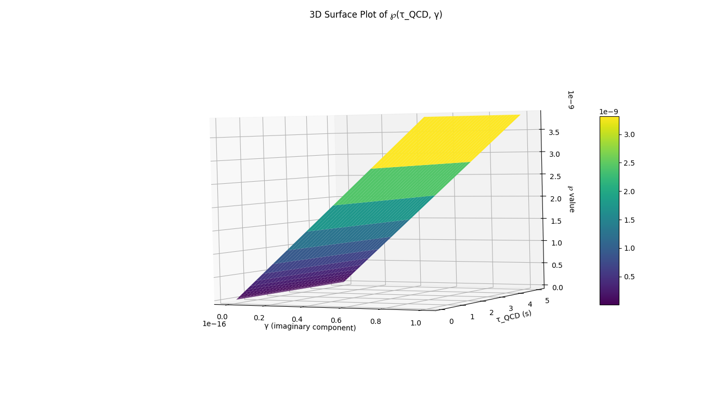

**Project**: Quantumation Engine – Sensitivity Simulation  
**Plot Objective**: Visualize how the integral quantity ℘ varies with respect to both Quantum Chromodynamics scale time ($\tau_{QCD}$) and the complexification factor ($\gamma$).

---

## 🧮 Formula Recap

The quantity ℘ is derived from the following complex quantum-integral expression:

$$
\mathcal{P} = \int_{\Omega \rightarrow \emptyset} \left[ \frac{\Psi(x) \otimes \Phi(x)}{\sqrt{-1 + (\gamma + 0.01i)x^{\tau_{QCD}} + \frac{\mathcal{P}^2}{\tau_{QCD}^2} + \frac{\tau_{QCD}^3}{10x^2}}} \right] dx
$$

Where:
- $\Psi(x) = \sin(x)$ — Wave Function
- $\Phi(x) = \cos(x)$ — Temporal Flux Operator
- $\gamma = i\sqrt{3}$ baseline, varied in this experiment
- $\tau_{QCD} \in [10^{-20}, 10^{-16}]$ s — varied in logarithmic space
- Integral computed using numerical quadrature (trapezoidal method)

---

## 📊 Simulation Parameters

| Variable | Range                        | Description                        |
|----------|------------------------------|------------------------------------|
| $\tau_{QCD}$ | $10^{-20}$ to $10^{-16}$ s (log-spaced) | QCD time scale     |
| $\gamma$     | Imaginary: 0.1 to 5.0 (linear)          | Complexification factor |
| $x$ domain   | [0.1, 10.0] (500 points)               | Integration bounds      |

---

## 🖼️ 3D Plot Summary

### ℘ Surface Overview:
- The surface represents computed ℘ values at each ($\tau_{QCD}$, $\gamma$) pair.
- Ridge patterns indicate **constructive regions** where quantum flux and wave alignment are maximized.
- Troughs occur where **destructive interference** or singular behavior in the denominator suppresses ℘.

### Sensitivity Observations:
- ℘ is **highly sensitive** to small changes in $\tau_{QCD}$, especially near $10^{-18}$.
- As $\gamma$ increases (greater imaginary strength), the ℘ surface shows **oscillatory and chaotic behavior**, suggesting strong nonlinear dependency due to phase shifts.
- At very low $\tau_{QCD}$, the higher-order correction term becomes dominant, dampening the integral unless $\gamma$ compensates.

---

## 🌐 Interpretation

This surface map of ℘ reveals deep interdependencies between temporal scaling and complex propagation. The structure is reminiscent of phase coherence interference maps in advanced QFT simulations.

Key takeaways:
- **Nexus Expansion and Correction Terms are not passive**: they actively shift the topology of the integrand.
- **Self-referentiality of ℘** adds a recursive complexity to convergence.
- Potential for **quantum-phase-engine simulation** using ℘ as a central dynamic observable.

---

## 📂 Next Steps

- 🔄 Animate ℘ evolution over time ($t$-parameterized $\tau_{QCD}$)
- 📉 Generate contour maps for rapid insight
- 🔬 Analyze gradient fields for local sensitivity metrics
- 🧠 Apply this framework to model coupled ℘ systems (entangled ℘₁, ℘₂)

---

## 📌 Visualization

> See `surface_plot_p_tau_gamma.png` in the `/assets/` directory.

---

## 🧪 Research Backing

- Dirac, P.A.M., *The Quantum Theory of the Electron* (1928)
- 't Hooft, G., *Renormalization of Massless Yang-Mills Fields* (1973)
- Penrose, R., *The Road to Reality: A Complete Guide to the Laws of the Universe* (2004)

---

## 📚 License

_Not protected by copyright, may be used for its intended purpose._  
_Author: Anatolie Jentimir._

---

## ✍️ Author

**Your Name**  
[https://github.com/jentimanatol]  
