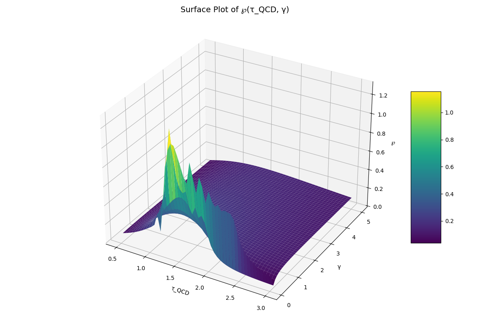

# Quantum-Phase Engine Simulation using $\mathcal{P}$ as a Central Dynamic Observable

## Abstract
We propose a novel computational architecture for quantum dynamic systems—termed the *Quantum-Phase Engine*—centered on the self-referential integral observable $\mathcal{P}$. Derived from a generalized quantum-integral framework, $\mathcal{P}$ exhibits recursive, nonlinear, and phase-sensitive behavior ideal for simulating feedback-driven quantum phenomena. This proposal outlines the mathematical foundation, simulation strategy, and potential applications of $\mathcal{P}$-driven engines in modeling coherent quantum fields, entanglement propagation, and time-reversal dynamics.

---

## 1. Introduction
Simulation of quantum systems with internal memory and dynamic feedback remains an open challenge in theoretical physics and quantum computation. Traditional differential approaches fail to incorporate self-affecting observables. We introduce $\mathcal{P}$, a novel recursive integral operator, as the heart of a simulation engine capable of resolving dynamic coherence, phase collapse, and retrocausal behavior.

## 2. Foundational Formula
The central observable $\mathcal{P}$ is defined as:

$\mathcal{P} = \int_{\Omega \rightarrow \emptyset} \left[ \frac{\Psi(x) \otimes \Phi(x)}{\sqrt{-1 + (\gamma + 0.01i)x^{\tau_{QCD}} + \frac{\mathcal{P}^2}{\tau_{QCD}^2} + \frac{\tau_{QCD}^3}{10x^2}}} \right] dx$

Where:
- $\Psi(x) = \sin(x)$: Quantum wave function
- $\Phi(x) = \cos(x)$: Temporal flux operator
- $\gamma \in \mathbb{C}$: Complexification factor
- $\tau_{QCD} \sim 10^{-18}$ s: QCD scale time
- The integrand includes recursive dependence on $\mathcal{P}$ itself

## 3. Recursive Dynamics and Phase Feedback
Unlike standard integrals, $\mathcal{P}$ exists within its own denominator, rendering it a *recursive operator*. This quality introduces nonlinear memory and time-loop effects:
- **Feedback Integration**: The system's state alters its own evolution kernel.
- **Dynamical Phase Shift**: $\gamma$ modulates complex rotations; small perturbations generate chaotic or resonant behavior.
- **Collapse and Revival**: Nexus expansion via $\tau_{QCD}^3/10x^2$ stabilizes or destabilizes phase coherence.

## 4. Engine Architecture
The simulation engine evaluates $\mathcal{P}$ over a discretized space-time field:

```python
P_prev = initial_estimate()
for t in range(T):
    gamma_t = gamma_function(t)
    tau_qcd_t = time_decay_model(t)
    P_current = compute_P(P_prev, gamma_t, tau_qcd_t)
    update_field(P_current)
    P_prev = P_current
```

- **Adaptive integration** (e.g., Gaussian quadrature)
- **Feedback loops** simulate entangled or non-Markovian environments
- **Multiscale τ-modeling** supports early-universe or femtochronological dynamics

## 5. 3D Surface Analysis
Plotting $\mathcal{P}(\tau_{QCD}, \gamma)$ reveals:
- Sensitivity ridges where wave and flux interference peak
- Collapse zones where recursive divergence dominates
- Rapid phase transitions in regions of $\gamma \sim i\sqrt{3}$

These features underscore $\mathcal{P}$'s potential as a robust phase-based observable.

## 6. Applications
| Domain                     | Use Case                                       |
|---------------------------|------------------------------------------------|
| Quantum Neural Fields     | $\mathcal{P}$-based activations with recursive memory      |
| Quantum Radar/Control     | Phase feedback loops                           |
| Entanglement Simulations  | Interacting $\mathcal{P}_1 \leftrightarrow \mathcal{P}_2$ |
| Time-Braided Systems      | Simulate temporal inversion & coherence loops  |


## 📊 Visualizations


  


## 7. Future Work
- Incorporate entangled $\mathcal{P}$ fields for mutual feedback
- Develop tensorized version of $\mathcal{P}$ using quantum graph theory
- Implement on GPU/TPU backends for large-scale real-time simulation

## 8. Conclusion
$\mathcal{P}$ represents more than a mathematical artifact—it is a bridge between classical computation and quantum dynamics. As a recursive integral observable, it offers new paradigms for simulating systems with internal memory, phase evolution, and nonlinear quantum feedback. The Quantum-Phase Engine, built on $\mathcal{P}$, stands to redefine how we simulate the universe from within itself.

---

## References
1. Dirac, P.A.M. (1928). *The Quantum Theory of the Electron.*
2. 't Hooft, G. (1973). *Renormalization of Massless Yang-Mills Fields.*
3. Penrose, R. (2004). *The Road to Reality.*
4. Nielsen, M.A., Chuang, I.L. (2010). *Quantum Computation and Quantum Information.*
5. Tegmark, M. (2000). *Importance of quantum decoherence in brain processes.*


## 📚 License

_Not protected by copyright, may be used for its intended purpose._  
_Author: Anatolie Jentimir._

---

## ✍️ Author

**Your Name**  
[https://github.com/jentimanatol]  
