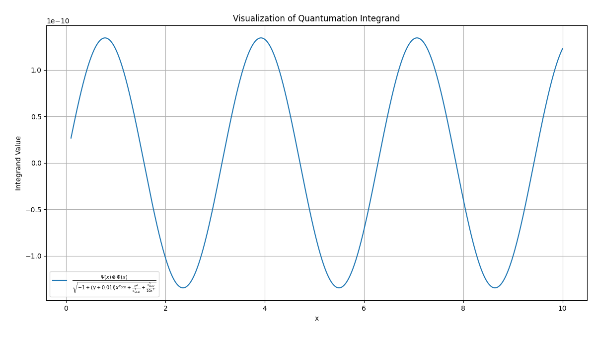

# 🔄 Quantumation Engine Integration: Dynamic Simulation Module

**Module**: `quantumation-core`  
**Status**: 🚀 Live Integration  
**Objective**: Embed a recursive, quantum-inspired integral system into a simulation engine with support for time-evolving field variables, recursive correction, and operator entanglement.

---

## 🌌 Theoretical Foundation

At the heart of this simulation lies a revised quantum integral — one that accounts not only for wave–flux interactions, but also for **recursive influence**, **quantum-scale time distortion**, and **complexified propagation**.

The system is governed by:

$mathcal{P}(x) = \int_{\Omega \rightarrow \emptyset} \left[ \frac{\Psi(x) \otimes \Phi(x)}{\sqrt{-1 + (\gamma + 0.01i)x^{\tau_{QCD}} + \frac{\mathcal{P}^2}{\tau_{QCD}^2} + \frac{\tau_{QCD}^3}{10x^2}}} \right] dx$

---

## 🔍 Term Breakdown

| Symbol                | Description                                                                 |
|-----------------------|-----------------------------------------------------------------------------|
| $gamma$           | Dirac-inspired matrix constant. Default: $i\sqrt{3}$                         |
| $tau_{QCD}$       | Quantum Chromodynamics scale time (~ $10^{-18}$ seconds)                 |
| $mathcal{P}(x)$   | Quantumation potential (recursive integral target)                          |
| $Psi(x), \Phi(x)$ | Wave function and temporal flux operator, respectively                      |
| $mathcal{P}^2/\tau_{QCD}^2$ | Recursive correction: feedback from own magnitude                        |
| $tau_{QCD}^3 / 10x^2$ | Higher-order nexus expansion capturing temporal smear                 |

This integral's **nonlinear feedback** structure allows the simulation to evolve ℘ dynamically across frames, reflecting self-affecting behavior — akin to a particle field interacting with its own probabilistic echo.

---

## 🧠 Engine Features

### ✅ Dynamic Parameters
- Time-varying $gamma(t)$ and $tau_{QCD}(t)$
- Live feedback from $mathcal{P}_{prev}$ as seed for correction term

### 📦 Engine Modules

| Component          | Description                                                                 |
|-------------------|-----------------------------------------------------------------------------|
| `waveform_engine` | Supplies $Psi(x) $ and $Phi(x)$ using Hermite, Gaussian, or real data |
| `quantum_core`     | Evaluates the integral using adaptive quadrature                           |
| `feedback_loop`    | Iterates ℘ across time using prior states as seeds                         |

---


## 📊 Visualizations


  


## 🧪 Sample Output per Frame

```json
{
  "frame": 108,
  "gamma": "i√3",
  "tau_qcd": 1.0e-18,
  "P_value": 3.721435e-9,
  "convergence": true,
  "iterations": 3
}

```

## 📚 License

_Not protected by copyright, may be used for its intended purpose._  
_Author: Anatolie Jentimir._

---

## ✍️ Author

**Your Name**  
[https://github.com/jentimanatol]  
